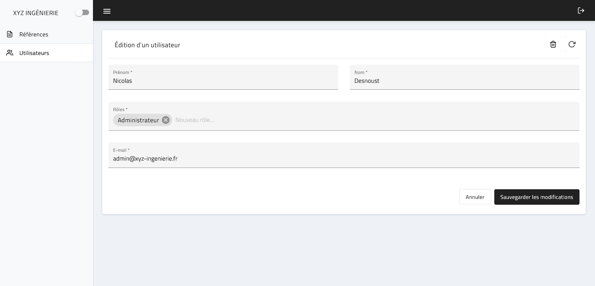
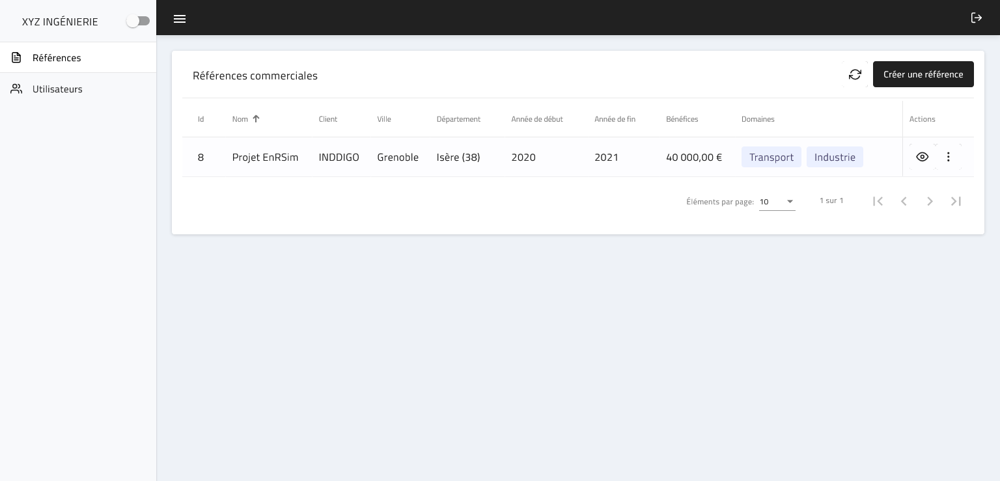

# XYZ Ingénierie

## Présentation du projet initial

Ce projet a été à l'origine réalisé dans le cadre du cours d'Architecture des applications du Master 2 Ingénierie du Logiciel et des Données. Il a été réalisé en autonomie et en binôme. Il s'agit d'une initiation au développement de Single Page Applications avec le framework Angular.

L'application doit principalement permettre à une société d'ingénierie française factice de capitaliser des références commerciales. La repository de cette première version du projet est disponible [ici](https://github.com/NicolasDesnoust/XYZ-ANGULAR-STJ-ILD-DESNOUST-LY).

## Reprise du projet

Ce projet a depuis été repris pour faire office de terrain de jeu personnel dans lequel j'explore de nouveaux concepts. Les concepts explorés sont détaillés dans les sections ci-dessous.

L'application actuelle propose deux modules fonctionnels, un pour gérer des références commerciales et un pour gérer des comptes utilisateurs. Chaque module a ainsi&nbsp;:

- Une page pour consulter la liste des éléments (références ou utilisateurs).
- Une pour pour créer ou modifier des éléments.
- Une page pour consulter les détails d'un élément.

Voici un aperçu de l'interface actuelle de l'application&nbsp;:

### Fonctionnalités notables du Backend

Le backend est développé à l'aide du framework Spring Boot et n'est encore que très récent. Il était auparavant mocké à l'aide de la librairie [Json Server](https://www.npmjs.com/package/json-server). Il intègre néanmoins plusieurs concepts intéressant à mentionner&nbsp;:

- La gestion d'exception centralisée avec `@ControllerAdvice` et `@ExceptionHandler`.
- L'utilisation de [Flyway](https://flywaydb.org/) pour effectuer des migrations de base de données.
- La documentation de l'API REST avec la librairie [Spring doc](https://springdoc.org/) et selon la spécification [Open Api 3](https://swagger.io/specification/).
- La création de Repositories avec [Spring Data](https://spring.io/projects/spring-data) et la [dérivation de requêtes](https://www.baeldung.com/spring-data-derived-queries).
- L'utilisation du design pattern [Data Transfert Object](https://martinfowler.com/eaaCatalog/dataTransferObject.html) (DTO) pour découpler les entités manipulées au sein du back-end de celles exposées aux clients de l'API REST.
- L'utilisation de [Spring Security](https://spring.io/projects/spring-security) pour implémenter un mécanisme d'authentification par cookies de session.
- L'implémentation d'un mécanisme d'autorisation de type [Role Based Access Control](https://fr.wikipedia.org/wiki/Contr%C3%B4le_d%27acc%C3%A8s_%C3%A0_base_de_r%C3%B4les) (RBAC). 

### Fonctionnalités notables du Frontend

Plusieurs concepts avancés concernant le développement frontend (et plus spécifiquement avec Angular) ont été explorés et sont détaillés dans les sections suivantes.

#### Architecture

Le code source est organisé selon l'architecture modulaire [Core/Shared/Features](https://blog.logrocket.com/angular-modules-best-practices-for-structuring-your-app/#typesofmodulesinangular). Cette architecture est un bon point de départ pour des applications de taille moyenne à grande, et propose un bon compromis entre performances et expérience de développement.

Chaque module est lui-même organisé en couches (composants, services métier, modèle, guardiens de routes, store NGRX, etc.).

Finalement, la couche des composants est scindée en deux, selon le design pattern [Smart Components vs Presentational Components](https://blog.angular-university.io/angular-2-smart-components-vs-presentation-components-whats-the-difference-when-to-use-each-and-why/). Cette séparation s'est avérée effective pour :

- Définir précisément les interactions entre composants.
- Décider dans quels composants doivent être injectés les services métier.
- Faciliter la réutilisation des composants destinés à la présentation.

#### Gestion d'état centralisée

La librairie [NGRX](https://ngrx.io/) est utilisée pour gérer l'état de l'application de manière centralisée. Malgré sa complexité apparente, NGRX a permit d'implémenter des fonctionnalités avancées telles que&nbsp;:

- La mise en cache des données récupérées auprès du backend, pour bénéficier de meilleures performances.
- La sauvegarde automatique du contenu des formulaires, pour pouvoir par la suite les restaurer si l'utilisateur a été déconnecté de sa session (la sauvegarde automatique a été implémentée, pas la restauration).
- Le découplage entre les composants et la manipulation des données, rendant ces composants plus simple à maintenir.
- La pagination côté serveur des tableaux de données.

#### Autorisations

Le contenu de l'application est considéré privé par défaut. L'utilisateur est donc redirigé vers un formulaire d'authentification lorsqu'il se rend sur l'application à l'aide des [guardiens de route](https://angular.io/guide/router#preventing-unauthorized-access) d'Angular. L'interface ne tient pas encore compte des permissions de l'utilisateur (ex: peut-il modifier des références commerciales ?) mais ces dernières sont implémentées dans le back-end.

#### Formulaires

Les formulaires de l'application sont implémentés de manière [réactive](https://angular.io/guide/reactive-forms). Les formulaires réactifs permettent un accès synchrone aux données, une immutabilité avec les observables de [RxJS](https://rxjs.dev/), et un suivi des modifications via des streams d'observables.

Les concepts expérimentés au niveau des formulaires ont principalement vocation à rendre ces derniers plus faciles à maintenir&nbsp;:

- Les champs complexes sont implémentés à l'aide des interfaces `ControlValueAccessor` et `MatFormFieldControl` qui permettent d'intégrer ces nouveaux champs avec respectivement les formulaires réactifs d'Angular et les formulaires de la librairie UI [Material Design](https://material.angular.io). La complexité de certains champs (multi-sélection, auto-complétion, etc.) est ainsi encapsulée dans des composants dédiés.

- Les messages d'erreur de validation des champs sont construit de manière à être réutilisés via une [directive](https://angular.io/guide/built-in-directives). Un message d'erreur par défaut est ainsi proposé pour chaque problème de validation (champ manquant, champ trop court, email invalide, etc.) et est remplaçable si besoin.

#### Expérience utilisateur

Le projet inclu également des fonctionnalités visant à améliorer l'expérience des utilisateurs&nbsp;:

- L'envoi de notifications lorsque l'utilisateur exécute une action notable (rafraîchissement, etc.).
- L'affichage d'indicateurs de chargement lorsqu'un processus est en cours.
- L'affichage de modaux de confirmation lorsque l'utilisateur déclenche une action critique, peut-être de manière involontaire.

## Roadmap du projet

### Priorité actuelle

Cette repository a actuellement pour vocation d'expérimenter différents concepts pour déterminer s'ils peuvent être utilisés dans des projets d'entreprise ou non. Cependant, elle a atteint un stade de maturité suffisant pour être également utilisée comme démonstration de mes compétences en développement fullstack ou comme guide pour des développeurs souhaitant s'inspirer de mon travail, dans une initiative open-source.

La priorité actuelle est donc de préparer une démonstration en live, pour pouvoir découvrir la version la plus récente / stable du projet sans avoir besoin de télécharger le code source. Pour rendre cette démonstration possible, le travail a effectuer inclut&nbsp;:

- Stocker les données du back-end en session pour que n'importe quel utilisateur puisse effectuer des modifications sans altérer l'expérience des autres utilisateurs.
- Implémenter les tests unitaires du back-end et corriger tout bug éventuel pour garantir une expérience utilisateur optimale.
- Rendre l'application 100% responsive sur mobile.

### Concepts supplémentaires à explorer

Voici un aperçu des travaux que j'aimerais également réaliser et intégrer à ce projet par la suite&nbsp;:

- Poursuivre la migration de la gestion d'état du front-end vers NGRX, et notamment la partie authentification.
- Ajouter plus de principes du [Domain Driven Design](https://fr.wikipedia.org/wiki/Conception_pilot%C3%A9e_par_le_domaine) au back-end.
- Renforcer l'architecture du back-end en vérifiant les interactions entre ses modules logiques. Cela pourrait se faire avec les modules Maven ou avec une solution plus légère, à savoir la libraire [Modulith](https://github.com/odrotbohm/moduliths).
- Implémenter un système de filtrage sur les références commerciales et utilisateurs.
- Finaliser l'autorisation RBAC, en utilisant les privilèges des utilisateurs pour conditionner l'affichage des composants de l'interface utilisateur.
- Implémenter le mécanisme d'autorisation de type [Attribute Based Access Control](https://cheatsheetseries.owasp.org/cheatsheets/Authorization_Cheat_Sheet.html#prefer-feature-and-attribute-based-access-control-over-rbac) (ABAC), ainsi que des fonctionnalités qui permettraient de démontrer son efficacité par rapport au RBAC.